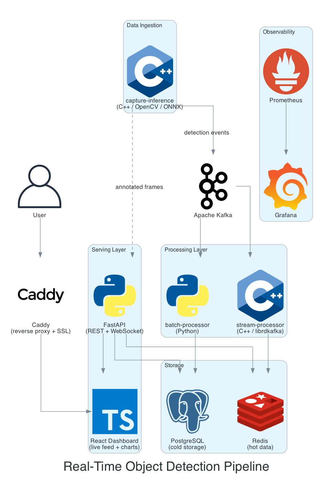

# Real-Time Object Detection Pipeline

A self-hosted real-time video analytics system running on a Raspberry Pi 5 (8GB). Runs YOLOv8 inference in C++ via ONNX Runtime, streams detection events through Apache Kafka, processes data with Python batch aggregation, and serves a live dashboard via React.

## Architecture



### Services

| Service | Language | Description |
|---------|----------|-------------|
| `capture-inference` | C++ | Captures webcam frames via OpenCV, runs YOLOv8 inference via ONNX Runtime, publishes detection events to Kafka, serves annotated frames via MJPEG stream |
| `stream-processor` | C++ | Kafka consumer that aggregates detections in real-time using sliding window, writes hot data to Redis |
| `batch-processor` | Python | Consumes detection events from Kafka, writes to PostgreSQL, runs scheduled hourly aggregation and cleanup |
| `api` | Python (FastAPI) | REST API serving real-time data from Redis and historical data from PostgreSQL |
| `frontend` | React/TypeScript | Live video feed via MJPEG, real-time detection charts, historical data queries with date range picker |

### Data Flow

`capture-inference` produces two separate outputs:

```
Webcam
  |
  ▼
capture-inference (C++)
  |
  ├── 1. Capture frame
  ├── 2. Preprocess
  ├── 3. Run inference → get detections
  ├── 4. Draw bounding boxes on the frame
  |
  ├──▶ MJPEG stream (:8081/stream) → React dashboard (live video)
  └──▶ Detection event → Kafka (JSON metadata, no image)
                                 |
                           ┌─────┴─────┐
                           ▼           ▼
                    stream-processor  batch-processor
                    (real-time stats) (historical)
                           |           |
                           ▼           ▼
                         Redis     PostgreSQL
                           |           |
                           └─────┬─────┘
                                 ▼
                            API (REST)
                                 |
                                 ▼
                          React dashboard
                          (charts, timeline, alerts)
```

- **Annotated frames** are served directly from `capture-inference` as an MJPEG stream. The frontend displays these via a simple `` tag — no WebSocket or API proxy needed.
- **Detection events** (small JSON: timestamp, class, confidence, bbox coordinates) go through Kafka to two consumers:
  - **stream-processor** aggregates in real-time (sliding window counts, recent events) and writes to Redis
  - **batch-processor** writes every event to PostgreSQL and runs scheduled hourly aggregation
- The **API** reads from both Redis (real-time) and PostgreSQL (historical) and serves the frontend.

These paths are independent — if Kafka lags, video still plays. If the video stream drops, charts still update.

### Infrastructure

| Component | Purpose |
|-----------|---------|
| Apache Kafka | Event streaming between services |
| PostgreSQL | Persistent storage for historical detections and aggregations |
| Redis | Hot data cache for real-time aggregates and recent detections |
| Caddy | Reverse proxy with automatic SSL |
| Prometheus | Metrics collection from all services |
| Grafana | Monitoring dashboards and alerting |
| Docker Compose | Container orchestration for the full stack |
| GitHub Actions | CI/CD pipeline (test, build, deploy to home server) |

## Tech Stack

**Languages:** C++17, Python, TypeScript
**ML:** YOLOv8, ONNX Runtime
**Streaming:** Apache Kafka (librdkafka)
**Backend:** FastAPI
**Frontend:** React, TypeScript
**Databases:** PostgreSQL, Redis
**Infrastructure:** Docker, Docker Compose, GitHub Actions, Prometheus, Grafana, Caddy
**Build:** CMake, Google Test

## Project Structure

```
realtime-detection-pipeline/
├── services/
│   ├── capture-inference/     # C++ frame capture + YOLO inference + MJPEG stream
│   ├── stream-processor/      # C++ Kafka consumer + real-time aggregation
│   ├── batch-processor/       # Python batch aggregation
│   ├── api/                   # FastAPI REST server
│   └── frontend/              # React dashboard
├── docker-compose.yml
├── Caddyfile
├── prometheus.yml
├── docs/
│   └── architecture.png
├── .github/
│   └── workflows/
│       └── ci-cd.yml
└── README.md
```

## Development

### Prerequisites

- Raspberry Pi 5 (8GB) running Ubuntu Server
- Docker and Docker Compose
- CMake 3.20+
- Python 3.11+
- Node.js 18+
- A USB webcam

### Local Development

```bash
# Start infrastructure services (Kafka, Redis, PostgreSQL)
docker compose up -d kafka redis postgres

# Build and run capture-inference
cd services/capture-inference
cmake -B build && cmake --build build --config Debug
export MODEL_PATH="$(pwd)/models/yolov8n.onnx"
./build/bin/Debug/capture-inference

# Run stream-processor
cd services/stream-processor
cmake -B build && cmake --build build --config Debug
./build/bin/stream-processor

# Run batch-processor
cd services/batch-processor
pip install -r requirements.txt
python main.py

# Run API
cd services/api
pip install -r requirements.txt
uvicorn main:app --reload --port 8000

# Run frontend
cd services/frontend
npm install && npm run dev
```

### Full Stack (Docker)

```bash
docker compose up -d
```

### Running Tests

```bash
# capture-inference tests
cd services/capture-inference
cmake --build build --config Debug --target capture-inference_tests
cd build && ctest --output-on-failure -C Debug

# stream-processor tests
cd services/stream-processor
cmake --build build --config Debug --target stream-processor_tests
cd build && ctest --output-on-failure -C Debug
```

## Deployment

Self-hosted on a Raspberry Pi 5 (8GB). GitHub Actions builds ARM64 Docker images on push to `main`, pushes to GitHub Container Registry, and triggers a deploy via webhook to the Pi.

## Status

**In development.** All core services are functional and Dockerized. Both the real-time pipeline (capture-inference → Kafka → stream-processor → Redis → API → dashboard) and historical pipeline (Kafka → batch-processor → PostgreSQL → API → dashboard) are working end-to-end. All services are wired together in docker-compose with environment-based configuration. Remaining: Caddy reverse proxy with SSL, Prometheus/Grafana monitoring, GitHub Actions CI/CD, and deployment to Raspberry Pi 5.
